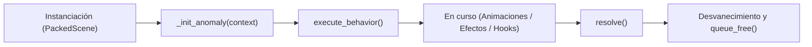

# 👁️ Guía Técnica y Flujo de Trabajo: Sistema de Anomalías Configurables (`anomaliesManagement`)

Esta guía describe la arquitectura, el ciclo de vida y el proceso paso a paso para crear, configurar e integrar nuevas anomalías modulares en el juego utilizando **Godot 4**.

---

## 🏗️ 1. Arquitectura del Sistema

El sistema desacopla los eventos narrativos de NPCs de las **anomalías configurables y visuales**:

| Componente | Archivo / Recurso | Rol y Responsabilidad |
|---|---|---|
| **Plantilla y Escena Base** | `AnomalyBase.tscn` / `AnomalyBase.gd` | Escena base para herencia (`New Inherited Scene`). Expone contenedores dedicados (`Visuals2D` para `CanvasLayer`/sprites 2D y `Visuals3D` para elementos 3D), `AnimationPlayer`, `AudioStreamPlayer`, `DurationTimer` y el ciclo de vida estándar. |
| **Recurso de Configuración** | `AnomalyData.gd` | Recurso (`.tres`) que empaqueta metadatos, rareza/pesos, condiciones de disparo y la referencia a la escena (`PackedScene`). |
| **Gestor Central** | `AnomaliesManager.gd` / `AnomaliesManagement.tscn` | Nodo central en `Main.tscn`. Homologa a `NPCEventManager`. Administra catálogo, evalúa disparadores, soporta concurrencia y expone controles de debug. |
| **Ejemplo Funcional** | `GlitchSpriteAnomaly.tscn` / `glitch_sprite_anomaly.tres` | Anomalía con distorsión ambiental, parpadeo de luces, overlay cromático, sprite fantasma errático y efecto de niebla. Disparo al 3.er cliente. |

### Principios de Diseño

- **Modularidad**: Cada anomalía es su propia escena independiente con script, visuales y lógica propios.
- **Concurrencia**: El sistema soporta múltiples anomalías activas simultáneamente (configurable).
- **Escalabilidad**: Agregar o quitar anomalías se hace desde el Inspector sin modificar código existente.
- **Activación/Desactivación**: Cada anomalía puede habilitarse o deshabilitarse individualmente por su `AnomalyData.enabled` o via `set_anomaly_enabled(id, bool)`.

---

## ⏱️ 2. Ciclo de Vida Estándar (`AnomalyBase`)

Toda anomalía implementa el ciclo de vida desacoplado:



1. **`_init_anomaly(context: Dictionary)`**:
   - Inyecta el contexto de la partida (`npc`, `spawn_count`, `served_count`, `current_day`, `manager`).
   - Configura parámetros iniciales, captura estado ambiental si será modificado. Emite la señal `anomaly_started`.
2. **`execute_behavior()`**:
   - Inicia la manifestación activa: reproduce animaciones, activa tweens, reproduce SFX, distorsiona el ambiente y activa temporizadores.
3. **`resolve()`**:
   - Concluye la anomalía. Restaura el ambiente a su estado original, reproduce la animación de salida `"resolve"` (si existe), emite `anomaly_resolved` y libera la instancia.

### Ganchos Opcionales (Hooks):
- `on_customer_arrived(npc: CharacterBody3D)`: Cuando un cliente llega al mostrador.
- `on_customer_served(npc: CharacterBody3D, is_correct: bool)`: Cuando se entrega un pedido.
- `on_persiana_closed()`: Si el jugador baja la persiana (ideal para ahuyentar entidades).
- `interact(interactor: Node)`: Para anomalías interactivas directas.

---

## 🛠️ 3. Paso a Paso: Cómo Crear una Nueva Anomalía

### Paso 1: Heredar de `AnomalyBase.tscn` en Godot
1. En Godot, clic derecho sobre `res://scenes/anomalies/AnomalyBase.tscn` → **Nueva escena heredada (New Inherited Scene)**.
2. Nombra la raíz (ej. `SombraAnomalia`).
3. Agrega nodos visuales:
   - **2D en pantalla/HUD**: `Sprite2D`, `AnimatedSprite2D`, `ColorRect` dentro de `Visuals2D` (CanvasLayer).
   - **3D en el mundo**: `Sprite3D`, `GPUParticles3D`, `MeshInstance3D` dentro de `Visuals3D`.
4. En `AnimationPlayer`, crea animaciones (la principal se recomienda como `"execute"`).
5. Guarda en `res://scenes/anomalies/SombraAnomalia.tscn`.

### Paso 2: Crear el Script
```gdscript
class_name SombraAnomalia
extends AnomalyBase

@export var effect_radius: float = 5.0

@onready var mi_sprite: Sprite2D = $Visuals2D.get_node_or_null("MiSprite")

# Estado ambiental original para restaurar
var _original_values: Dictionary = {}

func _init_anomaly(context: Dictionary = {}) -> void:
    super._init_anomaly(context)
    # Capturar estado original del ambiente ANTES de modificarlo
    _capture_original_state()
    # Configurar valores iniciales
    if mi_sprite:
        mi_sprite.modulate.a = 0.0

func execute_behavior() -> void:
    super.execute_behavior()
    # Afectar el ambiente del juego (luces, niebla, etc.)
    _distort_environment()
    # Disparar animación o efectos visuales propios
    if animation_player and animation_player.has_animation("execute"):
        animation_player.play("execute")
    # SFX opcional
    if SFXManager:
        SFXManager.play_tense_anger()

func resolve() -> void:
    if is_resolved:
        return
    # Restaurar el ambiente a su estado original
    _restore_environment()
    super.resolve()

func on_persiana_closed() -> void:
    resolve()

func _capture_original_state() -> void:
    # Guardar valores que serán modificados para poder restaurarlos
    pass

func _distort_environment() -> void:
    # Modificar luces, niebla, shaders del mundo, etc.
    pass

func _restore_environment() -> void:
    # Restaurar todo a _original_values
    pass
```

### Paso 3: Crear el Recurso `AnomalyData.tres`
1. En *FileSystem* → clic derecho en `res://resources/anomalies/` → **Nuevo Recurso** → `AnomalyData`.
2. Guardar como `res://resources/anomalies/sombra_anomalia.tres`.
3. Configurar en el **Inspector**:
   - **`id`**: `"sombra"` (único)
   - **`anomaly_name`**: `"La Sombra"`
   - **`anomaly_scene`**: Asignar la `.tscn`
   - **`tier`**: `RARE`
   - **`weight`**: `15.0`
   - **`enabled`**: `true` (desactivar con `false` para deshabilitarla sin borrarla)
   - Disparadores fijos o progresión según la sección 4.

### Paso 4: Dar de Alta en `anomaliesManagement`
En `Main.tscn`:
1. Selecciona el nodo `AnomaliesManagement`.
2. En el Inspector → **Catálogo de Anomalías**:
   - En `registered_anomalies`, añadir y arrastrar tu `.tres`.
   - *Alternativa rápida*: Arrastrar la `.tscn` directamente a `quick_packed_scenes`.

### Activar/Desactivar Anomalías en Runtime
```gdscript
# Desde cualquier script con acceso al nodo:
anomalies_manager.set_anomaly_enabled("sombra", false)  # Desactiva
anomalies_manager.set_anomaly_enabled("sombra", true)   # Reactiva
anomalies_manager.unregister_anomaly("sombra")           # Quita permanentemente
anomalies_manager.is_anomaly_enabled("sombra")           # Consulta estado
anomalies_manager.get_registered_ids()                   # Lista todos los IDs
anomalies_manager.get_debug_summary()                    # Resumen completo
```

---

## 🎛️ 4. Parámetros Disponibles para Condiciones de Aparición

Cada recurso `AnomalyData` cuenta con los siguientes disparadores configurables:

| Parámetro | Tipo | Descripción | Ejemplo |
|---|---|---|---|
| `trigger_exact_customer` | `int` | Disparo garantizado en el N.º exacto de cliente (`-1` = desactivado). | `= 3` → aparece en el 3.er cliente. |
| `trigger_min_served` | `int` | Umbral relativo: solo tras atender X clientes (`0` = sin umbral). | `= 10` → requiere experiencia previa. |
| `min_day` | `int` | Día mínimo para que pueda activarse. | `= 2` → NO aparece en Día 1. |
| `max_day` | `int` | Último día válido (`0` = sin límite). | `= 1` → exclusiva del primer día. |
| `weight` | `float` | Peso probabilístico relativo. A mayor peso, mayor frecuencia. | `50.0` (frecuente), `2.0` (crítica). |
| `tier` | `enum` | `COMMON`, `UNCOMMON`, `RARE`, `NIGHTMARE`. | `RARE` |
| `trigger_once` | `bool` | Si `true`, solo se ejecuta una vez por partida. | `true` |
| `enabled` | `bool` | Si `false`, la anomalía queda desactivada globalmente. | `true` |

### Configuración del Manager (`AnomaliesManager`):

| Parámetro | Descripción |
|---|---|
| `anomalies_enabled` | Activa/desactiva el sistema completo. |
| `random_anomaly_chance` | Probabilidad base de sorteo aleatorio (0.0-1.0). |
| `allow_concurrent_anomalies` | Permite múltiples anomalías activas simultáneamente. |
| `max_concurrent_anomalies` | Límite de anomalías concurrentes (`0` = sin límite). |

---

## 🧪 5. Depuración y Control en Tiempo de Ejecución

1. **`debug_force_anomaly` (String)**: Escribe el ID en el Inspector para forzar su aparición en el siguiente spawn.
2. **`debug_always_trigger` (bool)**: Fuerza 100% de probabilidad en sorteos.
3. **Tecla `F4`**: Disparo inmediato de la anomalía en tiempo de ejecución.
4. **Tecla `F3`**: Visor de contadores (NPCs aparecidos, atendidos, anomalías activas).
5. **Métodos de depuración por script**:
   - `force_trigger_anomaly("glitch_sprite")`: Dispara inmediatamente.
   - `resolve_all_anomalies()`: Limpia todas las anomalías activas.
   - `reset_anomalies()`: Reinicia estado de aparición.
   - `get_debug_summary()`: Diccionario con estado completo del sistema.

---

## 📦 6. Ejemplo Funcional: `GlitchSpriteAnomaly` (Distorsión Espectral)

**Archivos**:
- Escena: `res://scenes/anomalies/GlitchSpriteAnomaly.tscn`
- Script: `res://scripts/anomalies/GlitchSpriteAnomaly.gd`
- Shader: `res://shaders/glitch_anomaly.gdshader`
- Recurso: `res://resources/anomalies/glitch_sprite_anomaly.tres`

**Efectos de la anomalía al activarse:**
- 🔦 **Luces parpadean erráticamente** — OmniLights y SpotLights de la escena parpadean con intensidad variable.
- 🌫️ **Niebla se espesa** — La densidad de fog aumenta 4x y su color se torna rojizo.
- 🔴 **Overlay cromático** — Un `ColorRect` semitransparente rojo cubre la pantalla para dar sensación de distorsión.
- 👻 **Sprite fantasma con glitch** — Un sprite con shader de aberración cromática aparece en el HUD, vibrando y saltando de posición aleatoriamente.
- ⚠️ **Aviso en pantalla** — Texto parpadeante "ANOMALÍA DETECTADA: DISTORSIÓN ESPECTRAL".
- 🔊 **Efecto sonoro de tensión** — `SFXManager.play_tense_anger()`.

**Resolución**: Se resuelve automáticamente a los 8 segundos, o inmediatamente si el jugador cierra la persiana o atiende al cliente. Al resolverse, **restaura todo el ambiente** a su estado original con transiciones suaves.

**Configuración**: Disparo garantizado en el **3.er cliente** (`trigger_exact_customer = 3`), tier `RARE`, trigger_once = `true`.
